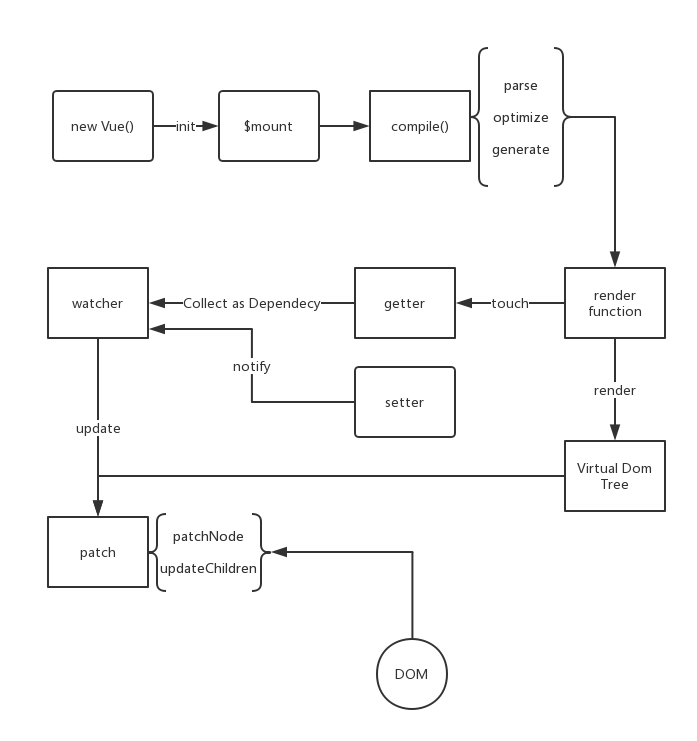

+ 1、初始化及挂载
```
    new Vue()  ->调用_init()函数初始化，初始化（生命周期，事件，props，methods，data,computed,watch等）
    初始化之后会调用$mount挂载组件。如果是运行时编译，即不存在render function

```

+ 2、编译
> 编译分为parse,optimize,generate三个阶段,最终得到render function
 - parse : 使用正则等方式解析template模板的指令，class,style等数据，形成AST

 - optimize: 标记static静态节点，这样update时，patch会跳过这个节点

 - generate: 将AST转换成render function 字符串的过程，会得到render的字符串以及staticRenderFns字符串

+ 3、响应式
 
 - init的时候会通过Object.defineProperty进行绑定，从而setter与getter能应对读取与赋值操作
 - render function倍手机的时候，会读取所需对象的值，从而触发getter函数进行依赖收集。
 - 依赖收集： 将观察者Watcher对象存放到当前闭包中的订阅者dep的subs中
 - 修改对象的值，出发setter，setter会notify Dep中的每一个watcher，告知值改变，需要渲染视图。watcher会调用update来更新试图
 - update的时候会有patch过程与使用队列来异步更新的策略 (setter -> watcher -> update)

 + 4、更新视图
  - 数据变化后，执行render function 可以得到新的VNode节点 
  - 解析新的VNode节点，然后用innerHtml直接全部渲染，这会造成性能浪费，从而中间加入patch过程，只渲染差异部分